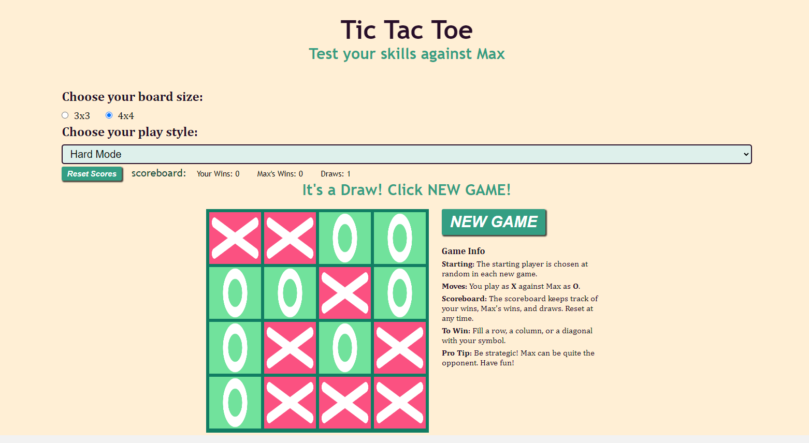
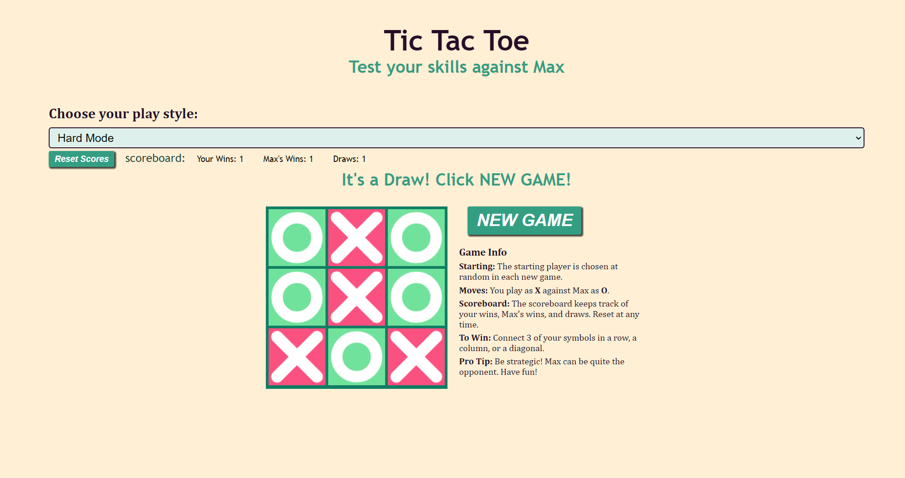

# Tic-Tac-Toe Game




## Test your skills against Max, the AI. Choose between Easy, Hard, and Random modes!

## Table of Contents
- [Introduction](#introduction)
- [Features](#features)
- [How to Play](#how-to-play)
- [Getting Started](#getting-started)
- [Contributing](#contributing)
- [Contact](#contact)

## Introduction
This is a simple Tic Tac Toe game that allows you to play against an AI opponent named Max. You have a choice between easy, hard, and random modes. When you click "New Game", the starting player is chosen randomly. The game board is responsive and will adjust to the size of your screen. The game is built with HTML, CSS, and JavaScript, using minimax algorithm for the AI. The scores are kept for each player, and the scores can be reset at any time.

## Features
- Interactive Tic Tac Toe gameplay.
- Play against an AI opponent (Max).
- Simple, intuitive, and responsive user interface.
- Three modes of play: easy, hard, and random.
- Scores are kept for each player.

## How to Play
1. Click the "New Game" button, and the starting player is chosen randomly.
2. You play as "X"; Max plays as "O."
3. To make a move, click on one of the empty squares on the game board.
4. Play strategically to block Max.
5. You win when you get three consecutive boxes.

   


## Getting Started
To play the game, simply open the [Tic Tac Toe Game](https://cynthiaweaver-jeannine.github.io/tic-tac-toe-game) in your web browser. You can also clone the repository and run it locally by following these steps:

1. Clone this repository:
   ```bash
   git clone https://github.com/CynthiaWeaver-Jeannine/tic-tac-toe-game
2. Open the index.html file in your web browser.

3. Start playing and test your skills against Max!

## Contributing
If you'd like to contribute to this project, please follow these steps:

1. Fork the repository.
2. Create a new branch with a descriptive name:
   ```bash
   git checkout -b feature/your-feature-name
3. Make your changes and commit them:
   ``` bash
   git commit -m "Add your feature description"
4. Push your changes to your fork:
   ``` bash
   git push origin feature/your-feature-name
5. Open a pull request to the main repository.


## Contact
If you have any questions, suggestions, or if your are interested in collaborating, contact me:

[cynthiajweaver@live.com](mailto:cynthiajweaver@live.com)  
[LinkedIn: Cynthia Weaver's LinkedIn Profile](https://www.linkedin.com/in/cynthiajweaver-dev?lipi=urn%3Ali%3Apage%3Ad_flagship3_profile_view_base_contact_details%3Bf625PYHuQgidhKLhsTuIuQ%3D%3D)  
[GitHub Repository for this game](https://github.com/CynthiaWeaver-Jeannine/tic-tac-toe-game)    


- [Go to top of page](https://github.com/CynthiaWeaver-Jeannine/tic-tac-toe-game/blob/main/README.md#tic-tac-toe-game)
   
